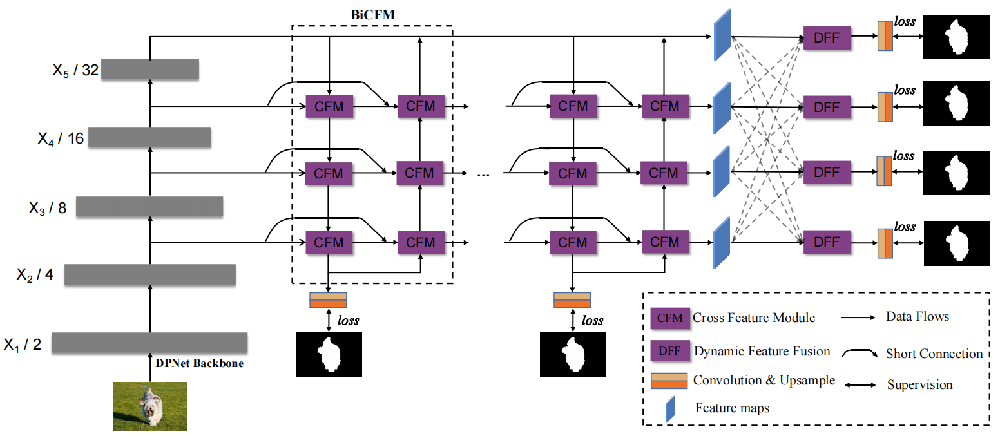

# DPNet: Dynamic Pyramid Neural Network for Salient Object Detection

## Abstract
In this paper, we attempt to reveal the nuance in the training strategy of salient object detection, including the choice of training datasets and the amount of training dataset that the model requires. Furthermore, we also expose the ground-truth bias of existing salient object detection benchmarks and their detrimental effect on performance scores. Based on our discoveries, we proposed a new two-stream framework that was trained on a small training dataset.  To effectively integrate features of different networks, we introduced a novel gate control mechanism for the fusion of two-stream networks that achieves consistent improvements over baseline fusion approaches. To preserves clear object boundaries, we also proposed a novel multi-layer attention module that utilizes high-level saliency activation maps to guide extract details information from low-level feature maps. Extensive experiment results demonstrate that our proposed model can more accurately highlight the salient objects with a small training dataset, and substantially improve the performance scores compared to the existing state-of-the-art saliency detection models.

## Network architecture

	

## Saliency Maps

We provide the [saliency maps](https://pan.baidu.com/s/1M73-wrHnoFOaLhADjDjs4A) (Fetch Code: iirk) for comparisions,  including DUTS-OMRON, DUTS-TE, ECSSD, HKU-IS, PASCAL-S. 
To obtain the same score with our paper, we recommend the [evaluation code](https://github.com/ArcherFMY/sal_eval_toolbox) provided by Feng Mengyang.

| Backbone | # params | FLOPs | saliency maps |
| :---: | :---: |  :---: |  :---: | 
| DPNet-50| 27.1M | 9.2G | |
| DPNet-101| 44.7.1M | 12.6G | |
| DPNet-152| 59.1M | 16G | |
